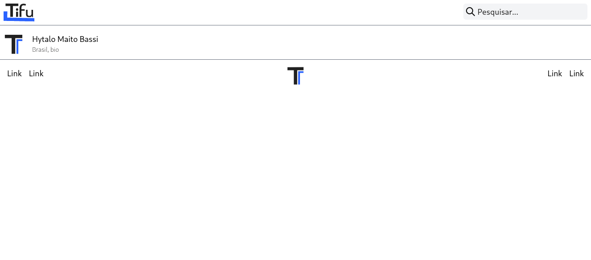

# frontifu

A front-end react app to Tifu

## Getting started

All you must do is download the dependencies, set up and
run. With this command:

```
yarn
export REACT_APP_API_URL=https://ec2-52-67-173-17.sa-east-1.compute.amazonaws.com
yarn start
```

#### Building

Almost the same thing

```
yarn build
serve -s build
```

## Developing

When developing you should care about some rules that is
in our project. They are very simple and will help other
developers, like you, writing code here.

- Care about your commit

When navigating through logs it's important to know what all these
commit is actualy doing. To understand what the commit should be,
it's recommended to take a look at [here](COMMITING.md).

- Lint the code

That rule is useful when developing because when the code gets larger,
see a lot of sentences, expressions, characters will be boring. To avoid
this we use some tools for linting and formatting the code.

- Test the code

Sometimes a developer forgot testing some component or function because
have another feature or bug to work in and that breaks an important
component in the application. Always automate the tests and make it
simple.

Some of this tasks can be done automatically with [husky](https://www.npmjs.com/package/husky).
To install husky hooks just run

```
yarn prepare
```

Now when you commit, husky will lint your commit message and format
the staged work.

## Screenshots

Light view: Home


Light view: New


Light view: User


